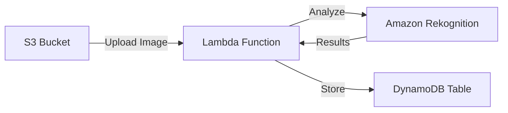
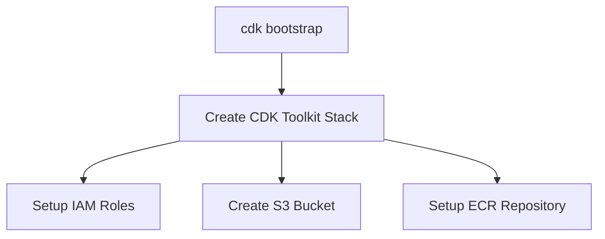
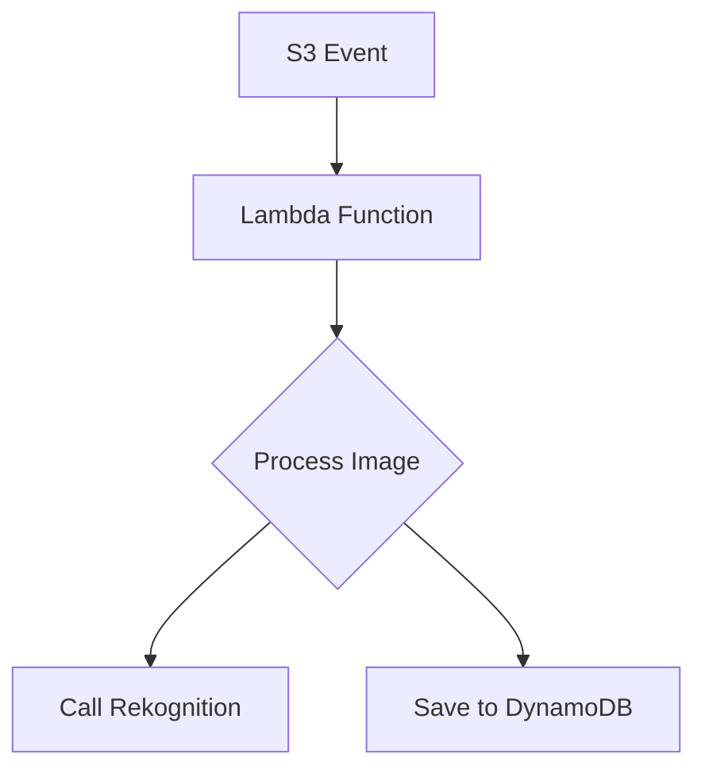
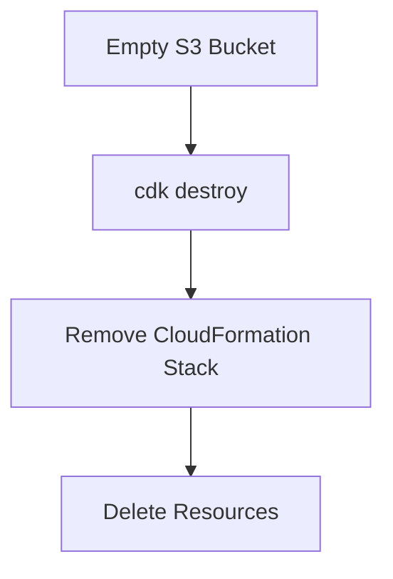

# Thực hành AWS CDK - Ứng dụng Phân tích Ảnh

## Mục lục
1. [Tổng quan](#tổng-quan)
2. [Cài đặt và Khởi tạo](#cài-đặt-và-khởi-tạo)
3. [Cấu trúc Code](#cấu-trúc-code)
4. [Triển khai và Kiểm thử](#triển-khai-và-kiểm-thử)

## Tổng quan

### Kiến trúc Ứng dụng


## Cài đặt và Khởi tạo

### 1. Cài đặt CDK CLI
```bash
sudo npm install -g aws-cdk-lib
```

### 2. Khởi tạo Project
```bash
mkdir cdk-app
cd cdk-app
cdk init app --language javascript
```

## Cấu trúc Code

### 1. Stack Definition (lib/cdk-app-stack.js)
```javascript
const { Stack } = require('aws-cdk-lib');
const s3 = require('aws-cdk-lib/aws-s3');
const lambda = require('aws-cdk-lib/aws-lambda');
const dynamodb = require('aws-cdk-lib/aws-dynamodb');

class CdkAppStack extends Stack {
  constructor(scope, id, props) {
    super(scope, id, props);

    // S3 Bucket
    const bucket = new s3.Bucket(this, 'ImageBucket', {
      removalPolicy: RemovalPolicy.DESTROY
    });

    // DynamoDB Table
    const table = new dynamodb.Table(this, 'ImageLabels', {
      partitionKey: { name: 'image', type: dynamodb.AttributeType.STRING },
      removalPolicy: RemovalPolicy.DESTROY
    });

    // Lambda Function
    const lambdaFn = new lambda.Function(this, 'ImageProcessor', {
      runtime: lambda.Runtime.PYTHON_3_9,
      handler: 'index.handler',
      code: lambda.Code.fromAsset('lambda'),
      environment: {
        TABLE_NAME: table.tableName,
        BUCKET_NAME: bucket.bucketName
      }
    });
  }
}
```

### 2. Lambda Function (lambda/index.py)
```python
import boto3
import os

def handler(event, context):
    rekognition = boto3.client('rekognition')
    dynamodb = boto3.resource('dynamodb')
    
    # Process image and store results
    # ...
```

## Triển khai và Kiểm thử

### 1. Bootstrap CDK


### 2. Quy trình Triển khai
1. **Synthesize**:
   ```bash
   cdk synth
   ```
   - Tạo CloudFormation template
   - Kiểm tra cấu hình

2. **Deploy**:
   ```bash
   cdk deploy
   ```
   - Triển khai stack
   - Tạo resources

### 3. Kiểm thử Ứng dụng
1. Upload ảnh vào S3
2. Lambda function tự động xử lý
3. Kiểm tra kết quả trong DynamoDB

## Các Thành phần Chính

### 1. S3 Bucket
- Lưu trữ ảnh đầu vào
- Trigger Lambda function
- Cấu hình event notifications

### 2. Lambda Function


### 3. DynamoDB Table
- Partition key: image name
- Lưu trữ labels từ Rekognition
- Auto-scaling enabled

## Clean Up

### Quy trình Dọn dẹp


1. **Empty S3 Bucket**:
   - Xóa tất cả objects
   - Verify bucket trống

2. **Destroy Stack**:
   ```bash
   cdk destroy
   ```
   - Xóa tất cả resources
   - Cleanup IAM roles

## Best Practices

1. **Quản lý Code**:
   - Version control
   - Modular structure
   - Clear documentation

2. **Security**:
   - IAM least privilege
   - Encrypt sensitive data
   - Regular updates

3. **Monitoring**:
   - CloudWatch logs
   - Error handling
   - Performance metrics