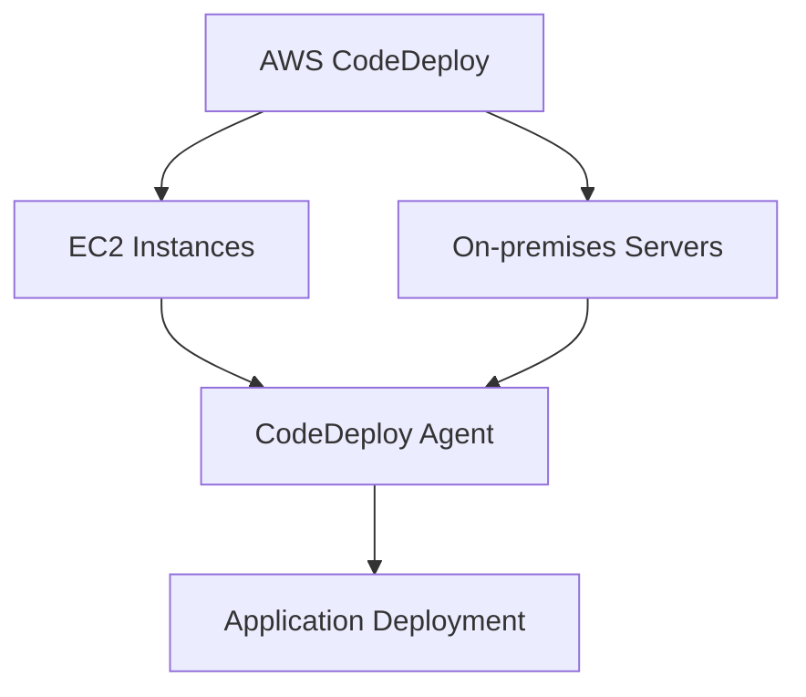
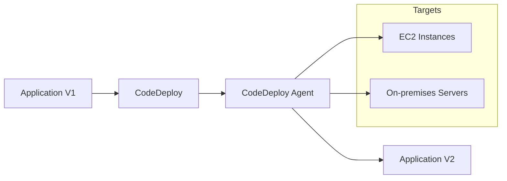
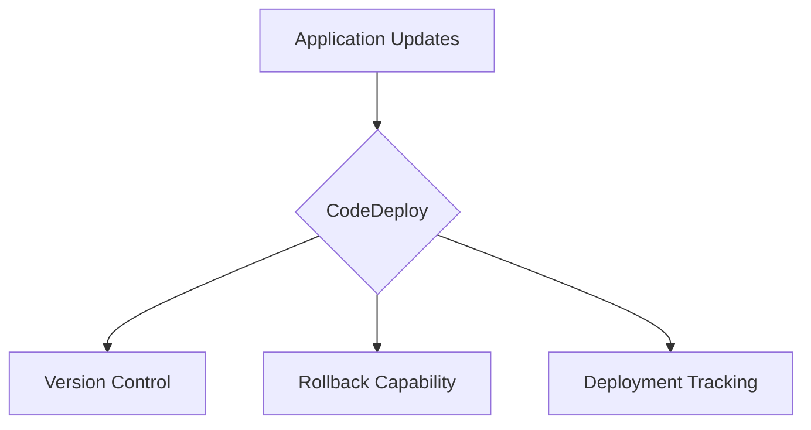
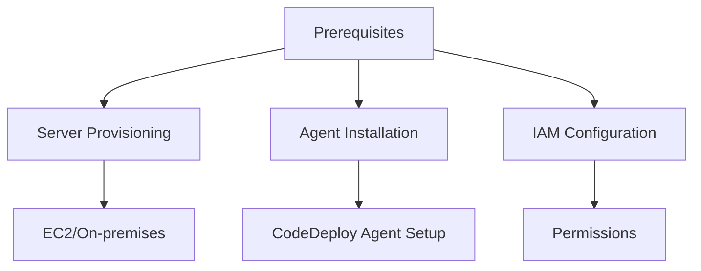

# Tổng quan về AWS CodeDeploy

## Mục lục
1. [Giới thiệu](#giới-thiệu)
2. [Kiến trúc và Hoạt động](#kiến-trúc-và-hoạt-động)
3. [Use Cases](#use-cases)
4. [So sánh với các Dịch vụ khác](#so-sánh-với-các-dịch-vụ-khác)

## Giới thiệu

AWS CodeDeploy là dịch vụ triển khai hybrid cho phép tự động hóa việc triển khai ứng dụng trên cả EC2 instances và On-premises servers.

### Đặc điểm chính

## Kiến trúc và Hoạt động

### 1. Thành phần chính
- CodeDeploy Service
- CodeDeploy Agent
- Application Source Code
- Appspec File

### 2. Quy trình Triển khai

## Use Cases

### 1. Hybrid Deployment
- Triển khai đồng thời trên cloud và on-premises
- Quản lý thống nhất quy trình triển khai
- Dễ dàng chuyển đổi từ on-premises lên cloud

### 2. Automated Updates

## So sánh với các Dịch vụ khác

### 1. CodeDeploy vs Elastic Beanstalk
| Tính năng | CodeDeploy | Elastic Beanstalk |
|-----------|------------|-------------------|
| Mục đích | Triển khai ứng dụng | Platform as a Service |
| Phạm vi | Hybrid | AWS only |
| Cấu hình | Manual server setup | Automated |
| Flexibility | Cao | Trung bình |

### 2. CodeDeploy vs CloudFormation
| Tính năng | CodeDeploy | CloudFormation |
|-----------|------------|----------------|
| Focus | Application deployment | Infrastructure as Code |
| Scope | Application layer | Full stack |
| Target | Existing servers | New resources |

## Lưu ý Quan trọng

### 1. Prerequisites

### 2. Best Practices
1. **Chuẩn bị Server**:
   - Provision trước servers
   - Cài đặt CodeDeploy agent
   - Cấu hình permissions

2. **Deployment Strategy**:
   - Rolling updates
   - Blue/Green deployment
   - Canary deployment

3. **Monitoring**:
   - Deployment health
   - Application logs
   - Agent status

## Tips và Tricks

1. **Agent Management**:
   - Tự động update agent
   - Health check định kỳ
   - Log rotation

2. **Security**:
   - IAM roles cho instances
   - Network security
   - Application security

3. **Troubleshooting**:
   - Agent logs
   - Deployment logs
   - Common issues