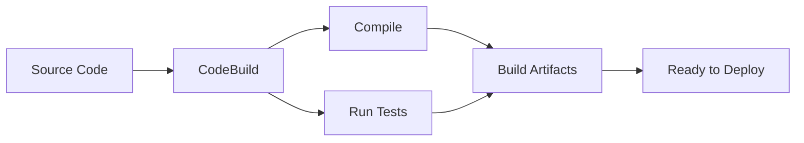
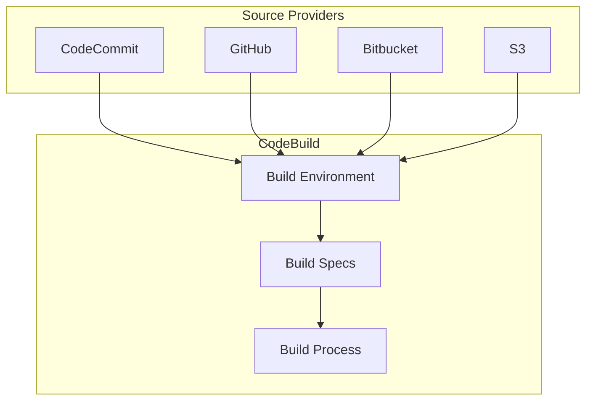
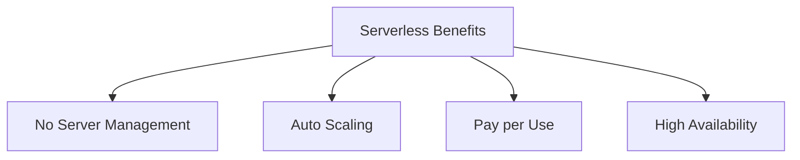
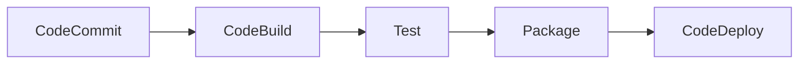
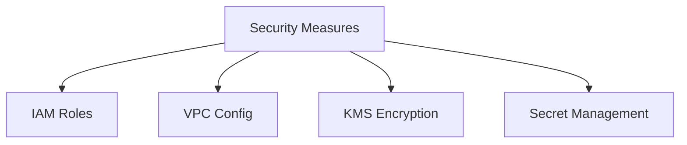

# Tổng quan về AWS CodeBuild

## Mục lục
1. [Giới thiệu](#giới-thiệu)
2. [Kiến trúc và Hoạt động](#kiến-trúc-và-hoạt-động)
3. [Lợi ích chính](#lợi-ích-chính)
4. [Use Cases](#use-cases)

## Giới thiệu

AWS CodeBuild là dịch vụ build code tự động, serverless cho phép biên dịch source code, chạy test và tạo ra các packages sẵn sàng để triển khai.

### Quy trình làm việc

## Kiến trúc và Hoạt động

### 1. Input Sources

### 2. Build Process
1. **Lấy Source Code**:
   - Pull từ repository
   - Download từ S3

2. **Thực thi Build**:
   - Chạy build commands
   - Execute tests
   - Generate artifacts

3. **Output**:
   - Tạo deployment packages
   - Store artifacts

## Lợi ích chính

### 1. Serverless Architecture

### 2. Cost Optimization
- Chỉ trả tiền cho thời gian build
- Không phí cố định
- Tự động scale

### 3. Integration
- AWS Services
- Source Control
- Deployment Tools

## Use Cases

### 1. CI/CD Pipeline

### 2. Automated Testing
- Unit Tests
- Integration Tests
- Security Scans

## Best Practices

### 1. Build Configuration
1. **buildspec.yml**:
   - Định nghĩa build steps
   - Specify dependencies
   - Configure artifacts

2. **Environment Variables**:
   - Secure credentials
   - Configuration values
   - Build parameters

### 2. Security

## Monitoring và Logging

### 1. CloudWatch Integration
- Build logs
- Metrics
- Alerts

### 2. Build Status
- Success/Failure tracking
- Build history
- Performance metrics

## Tips và Tricks

1. **Optimization**:
   - Cache dependencies
   - Parallel builds
   - Minimize build time

2. **Troubleshooting**:
   - Log analysis
   - Build reports
   - Error handling

3. **Maintenance**:
   - Regular updates
   - Clean up artifacts
   - Monitor costs