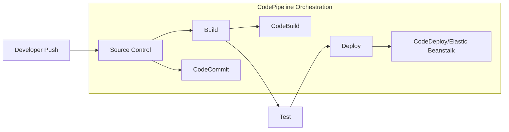
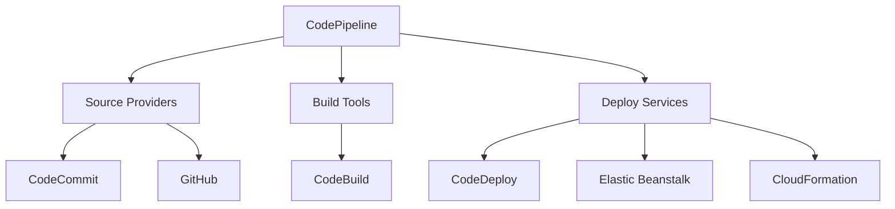
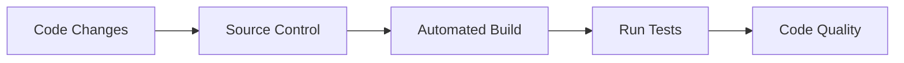
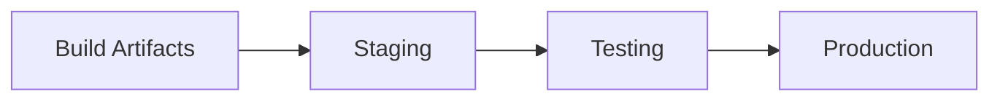
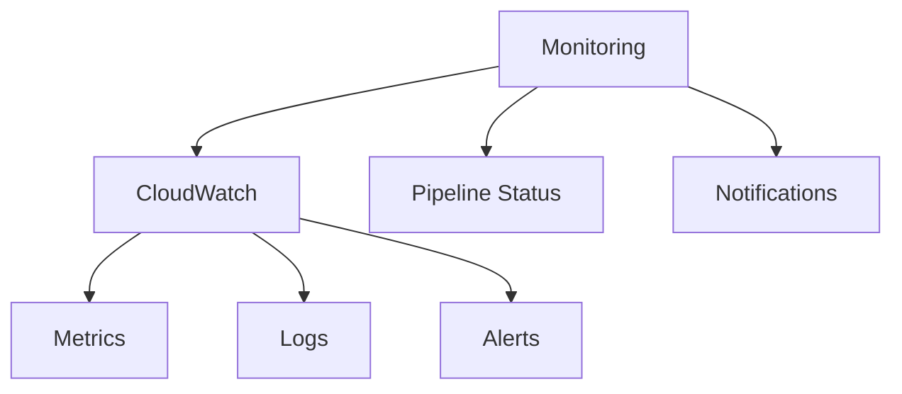

# Tổng quan về AWS CodePipeline

## Mục lục
1. [Giới thiệu](#giới-thiệu)
2. [Kiến trúc và Tích hợp](#kiến-trúc-và-tích-hợp)
3. [CI/CD Pipeline](#cicd-pipeline)
4. [Use Cases](#use-cases)

## Giới thiệu

AWS CodePipeline là dịch vụ CI/CD fully managed cho phép orchestrate và tự động hóa các bước để xây dựng, test và triển khai code.

### Quy trình CI/CD

## Kiến trúc và Tích hợp

### 1. Tích hợp Service

### 2. Pipeline Stages
1. **Source Stage**:
   - CodeCommit
   - GitHub
   - S3
   - Bitbucket

2. **Build Stage**:
   - CodeBuild
   - Jenkins
   - Third-party tools

3. **Test Stage**:
   - Automated testing
   - Security scanning
   - Code analysis

4. **Deploy Stage**:
   - CodeDeploy
   - Elastic Beanstalk
   - CloudFormation
   - Service Catalog

## CI/CD Pipeline

### 1. Continuous Integration

### 2. Continuous Delivery/Deployment

## Use Cases

### 1. Automated Release Process
- Code từ development đến production
- Multiple environment deployments
- Automated testing và validation

### 2. Multiple Deployment Strategies
- Blue/Green deployment
- Canary releases
- Rolling updates

## Best Practices

### 1. Pipeline Configuration
1. **Stage Organization**:
   - Logical grouping
   - Clear dependencies
   - Error handling

2. **Security**:
   - IAM roles
   - Encryption
   - Access control

### 2. Monitoring và Logging

## Lưu ý Quan trọng

### 1. Benefits
- Fully managed service
- Tích hợp đa dạng
- Tự động hóa cao
- Rapid delivery

### 2. Cost Optimization
- Pay per use
- No infrastructure costs
- Efficient resource utilization

### 3. Troubleshooting
1. **Common Issues**:
   - Pipeline failures
   - Integration errors
   - Permission issues

2. **Resolution Steps**:
   - Check logs
   - Verify configurations
   - Test connections

## Tips và Tricks

1. **Pipeline Design**:
   - Keep it simple
   - Modular stages
   - Reusable components

2. **Maintenance**:
   - Regular updates
   - Pipeline reviews
   - Performance optimization

3. **Documentation**:
   - Pipeline architecture
   - Configuration details
   - Troubleshooting guides