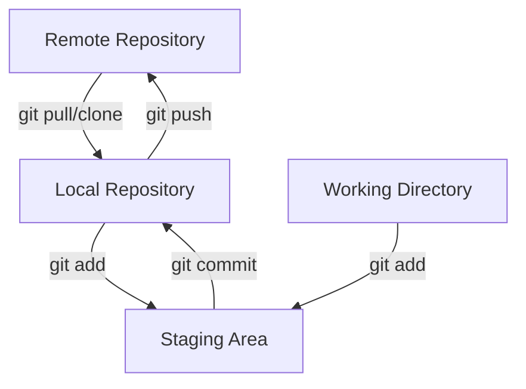
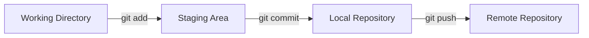
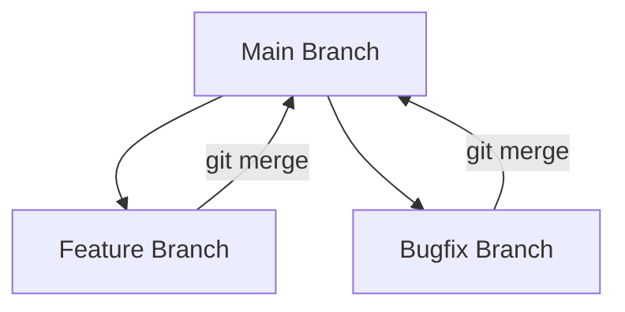
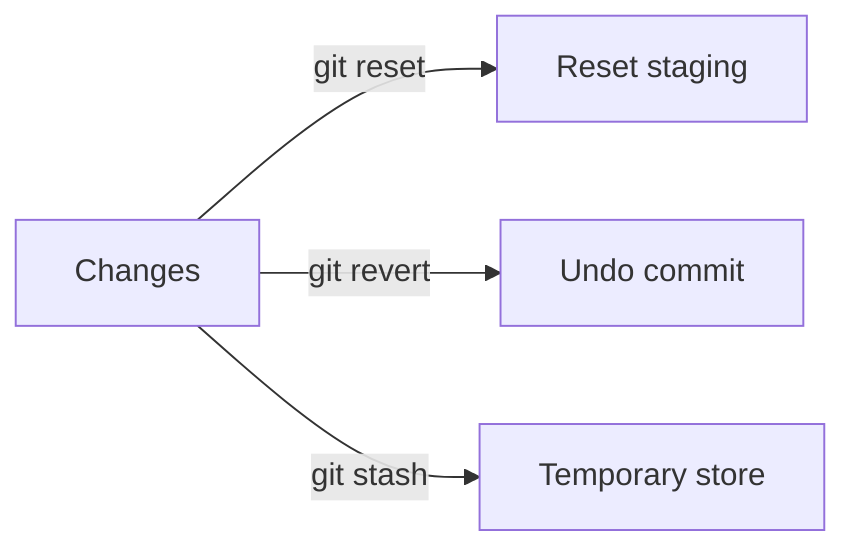

# Tổng quan về Git

## Mục lục
1. [Kiến trúc cơ bản](#kiến-trúc-cơ-bản)
2. [Các lệnh Git cơ bản](#các-lệnh-git-cơ-bản)
3. [Quy trình làm việc](#quy-trình-làm-việc)
4. [Các lệnh nâng cao](#các-lệnh-nâng-cao)

## Kiến trúc cơ bản

### Mô hình làm việc

## Các lệnh Git cơ bản

### 1. Thiết lập ban đầu
- `git init`: Khởi tạo repository mới
- `git config`: Cấu hình username, email
- `git clone [url]`: Tải repository từ remote

### 2. Làm việc với Files

### 3. Quản lý branches

## Bảng tổng hợp các lệnh Git

### 1. Lệnh cơ bản
| Lệnh | Mô tả |
|------|--------|
| `git init` | Khởi tạo repository |
| `git clone` | Tải repository từ remote |
| `git add` | Thêm file vào staging area |
| `git commit` | Commit changes |
| `git status` | Kiểm tra trạng thái |
| `git log` | Xem lịch sử commit |

### 2. Branch Operations
| Lệnh | Mô tả |
|------|--------|
| `git branch` | Liệt kê branches |
| `git checkout` | Chuyển branch |
| `git merge` | Merge branches |
| `git branch -d` | Xóa branch |

### 3. Remote Operations
| Lệnh | Mô tả |
|------|--------|
| `git remote add` | Thêm remote repository |
| `git push` | Đẩy changes lên remote |
| `git pull` | Kéo changes từ remote |
| `git fetch` | Lấy changes không merge |

## Các lệnh nâng cao

### 1. Hoàn tác thay đổi

### 2. Advanced Operations
- `git rebase`: Tích hợp changes giữa branches
- `git cherry-pick`: Áp dụng commit cụ thể
- `git blame`: Xem lịch sử thay đổi file
- `git diff`: So sánh thay đổi

### 3. Bảo trì và Khôi phục
| Lệnh | Mục đích |
|------|-----------|
| `git fsck` | Kiểm tra file system |
| `git gc` | Dọn dẹp repository |
| `git reflog` | Theo dõi refs |

## Best Practices

### 1. Commit
- Commit message rõ ràng
- Commit nhỏ, tập trung
- Thường xuyên commit

### 2. Branching
- Tạo branch cho mỗi feature
- Merge thường xuyên từ main
- Xóa branch sau khi merge

### 3. Collaboration
- Pull thường xuyên
- Giải quyết conflicts sớm
- Review code trước merge

## Tips và Tricks

1. **Làm việc hiệu quả**:
   - Sử dụng `.gitignore`
   - Kiểm tra status thường xuyên
   - Backup repository

2. **Xử lý lỗi**:
   - Dùng `git log` để trace
   - Sử dụng `git reflog`
   - Backup trước khi reset