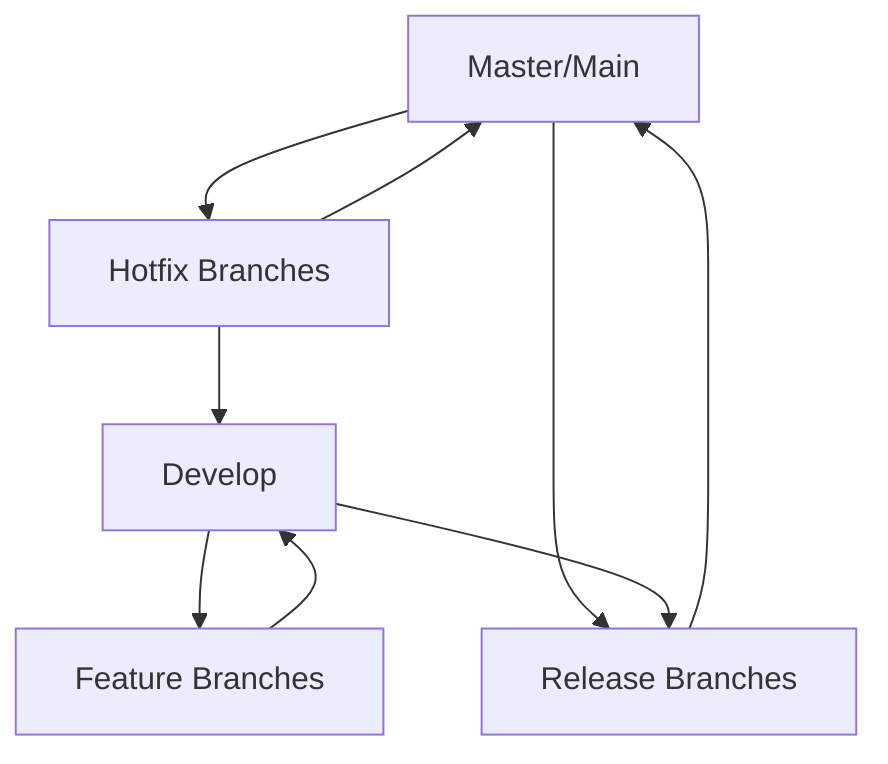
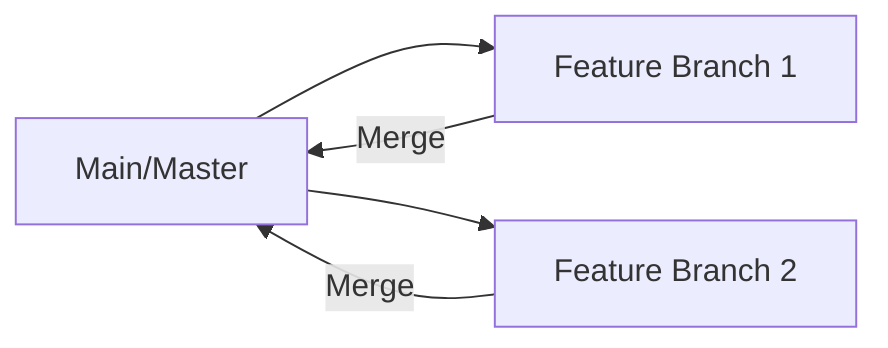
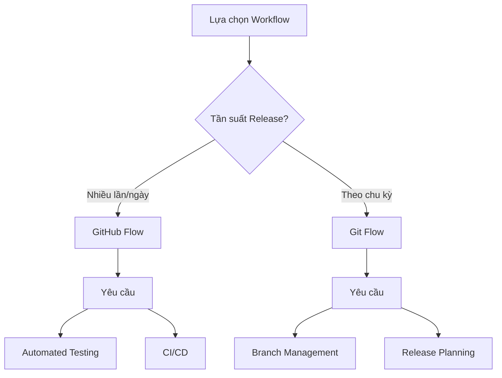

# So sánh Git Flow và GitHub Flow

## Mục lục
1. [Git Flow](#git-flow)
2. [GitHub Flow](#github-flow)
3. [So sánh và Lựa chọn](#so-sánh-và-lựa-chọn)
4. [Best Practices](#best-practices)

## Git Flow

### Cấu trúc Branches

### Các loại Branch
1. **Master/Main**:
   - Code production
   - Stable version

2. **Develop**:
   - Changes từ last release
   - Integration branch

3. **Feature Branches**:
   - Phát triển tính năng mới
   - Branch từ Develop

4. **Release Branches**:
   - Chuẩn bị release
   - Merge vào Master và Develop

5. **Hotfix Branches**:
   - Sửa lỗi khẩn cấp
   - Branch từ Master

## GitHub Flow

### Cấu trúc đơn giản

### Quy trình làm việc
1. **Branch từ Main**:
   - Tạo feature branch
   - Đặt tên mô tả

2. **Phát triển**:
   - Commit thường xuyên
   - Push lên remote

3. **Pull Request**:
   - Code review
   - Thảo luận

4. **Merge và Deploy**:
   - Merge vào main
   - Deploy ngay lập tức

## So sánh và Lựa chọn

### Bảng so sánh
| Tiêu chí | Git Flow | GitHub Flow |
|----------|----------|-------------|
| Độ phức tạp | Cao | Thấp |
| Số branches | Nhiều | Ít |
| Release cycle | Dài | Ngắn |
| Phù hợp với | Dự án lớn, release cycle dài | Dự án agile, release liên tục |
| Yêu cầu | Quản lý branches tốt | CI/CD tốt |

### Yếu tố quyết định

## Best Practices

### 1. Git Flow
- Quản lý branches chặt chẽ
- Documentation rõ ràng
- Merge strategy nhất quán

### 2. GitHub Flow
- Automated testing
- Quick deployments
- Feature flags

### 3. Chung
1. **Code Quality**:
   - Code review
   - Automated tests
   - Coding standards

2. **Communication**:
   - Clear commit messages
   - Detailed PR descriptions
   - Team collaboration

## Tips và Tricks

1. **Git Flow**:
   - Sử dụng tools hỗ trợ
   - Đặt quy tắc merge
   - Version tracking

2. **GitHub Flow**:
   - Feature toggles
   - Monitoring
   - Rollback plan

3. **Workflow Selection**:
   - Đánh giá team size
   - Release requirements
   - Project complexity