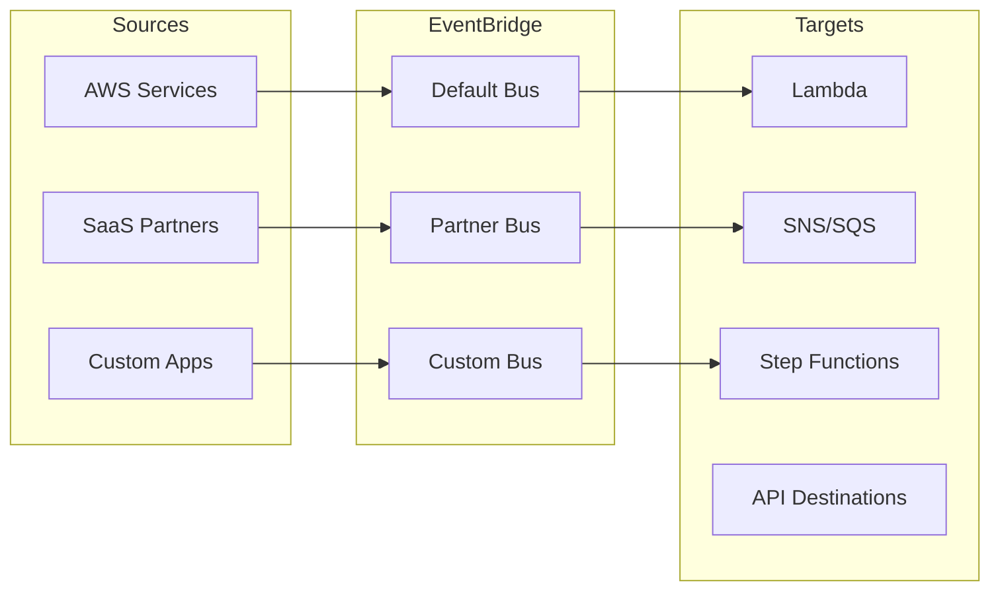
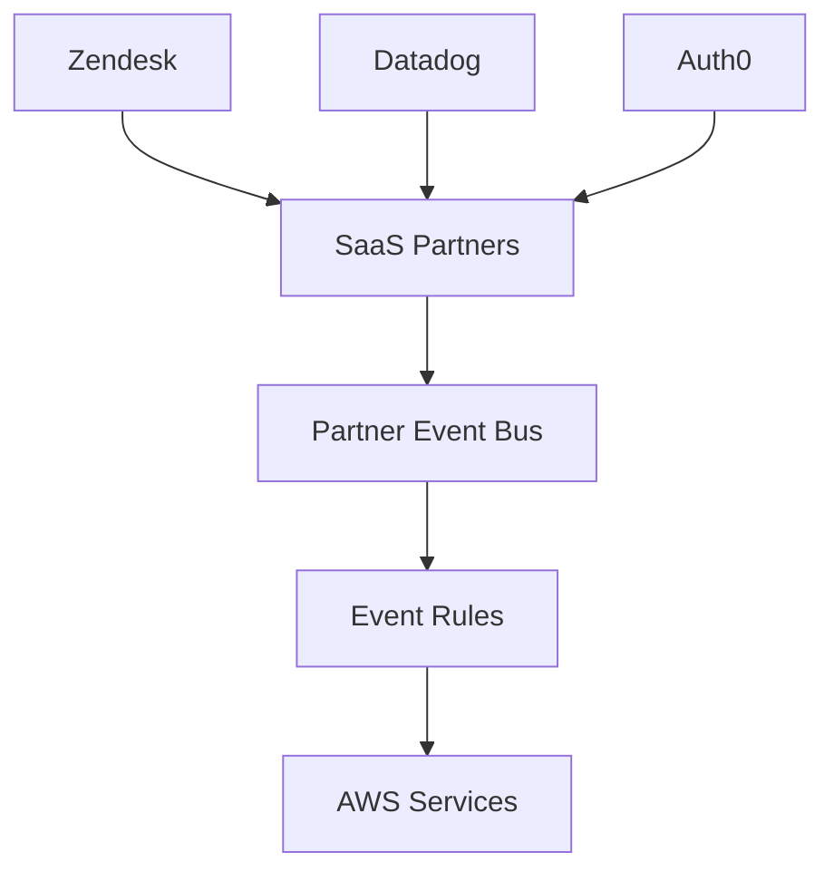
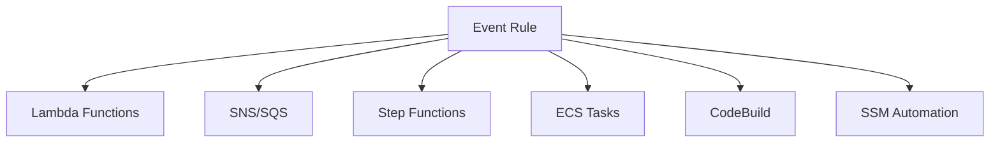
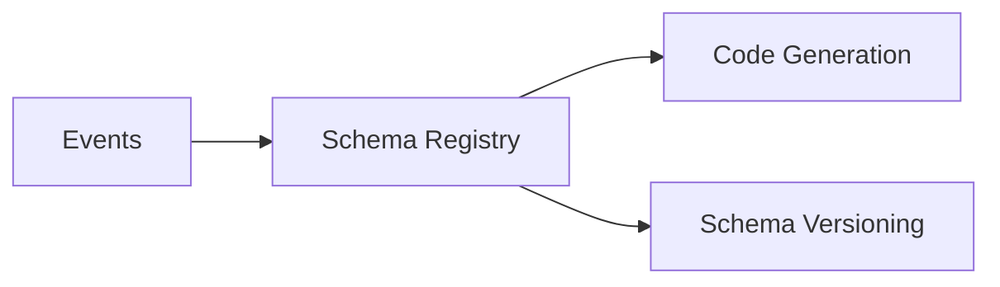
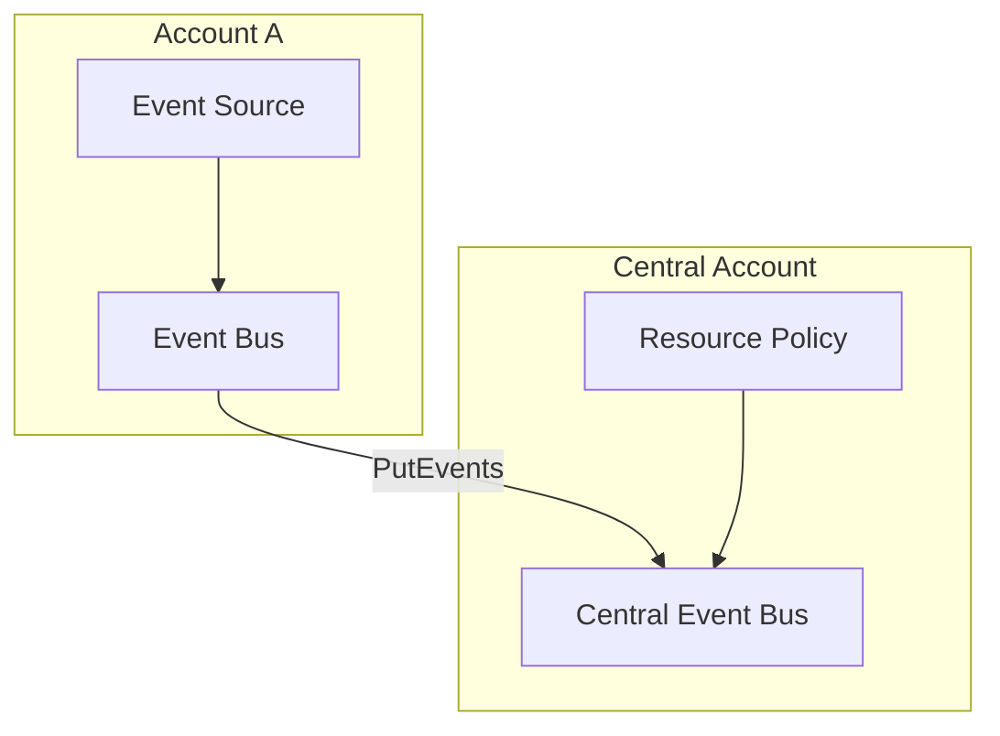

# Tổng quan về Amazon EventBridge

## Mục lục
1. [Giới thiệu](#giới-thiệu)
2. [Các loại Event Bus](#các-loại-event-bus)
3. [Event Rules và Targets](#event-rules-và-targets)
4. [Tính năng nâng cao](#tính-năng-nâng-cao)

## Giới thiệu

EventBridge (trước đây là CloudWatch Events) là dịch vụ serverless cho phép kết nối các ứng dụng thông qua dữ liệu real-time từ các nguồn khác nhau.

### Kiến trúc tổng quan

## Các loại Event Bus

### 1. Default Event Bus
- Nhận events từ AWS Services
- Tự động được tạo cho mỗi tài khoản
- Không thể xóa

### 2. Partner Event Bus

### 3. Custom Event Bus
- Tạo cho ứng dụng riêng
- Cross-account access
- Resource-based policies

## Event Rules và Targets

### 1. Event Rules
- Schedule-based (Cron)
- Event pattern matching
- JSON format filtering

### 2. Targets

## Tính năng nâng cao

### 1. Schema Registry

### 2. Event Archive
- Lưu trữ events
- Retention period setting
- Event replay capability

### 3. Cross-Account Event Bus

## Use Cases

### 1. Monitoring và Alerting
- IAM root user sign-in alerts
- Security findings notification
- Resource state changes

### 2. Automation
- Scheduled tasks
- Infrastructure automation
- Application integration

### 3. Application Integration
- SaaS integration
- Cross-account event handling
- Microservices communication

## Best Practices

### 1. Event Design
- Schema validation
- Event versioning
- Error handling

### 2. Security
- Resource-based policies
- Least privilege access
- Encryption in transit

### 3. Monitoring
- CloudWatch metrics
- Event logging
- Error tracking

## Tips và Troubleshooting

1. **Event Routing**:
   - Rule priority
   - Event pattern testing
   - Target retry policy

2. **Performance**:
   - Event batching
   - Concurrent execution
   - Rate limiting

3. **Maintenance**:
   - Schema updates
   - Archive management
   - Policy reviews