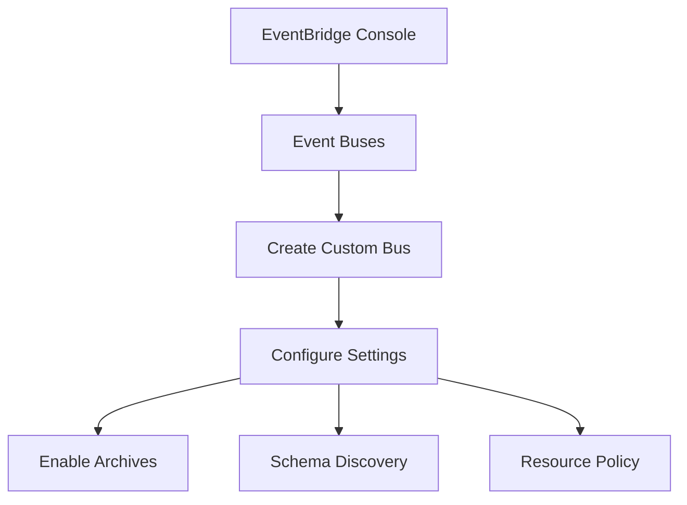
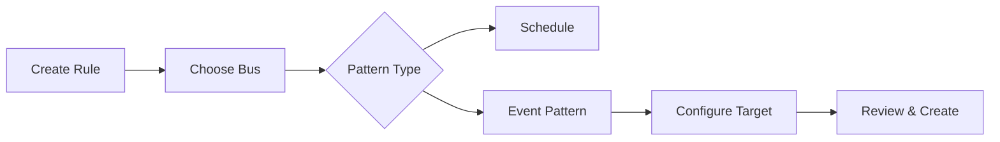
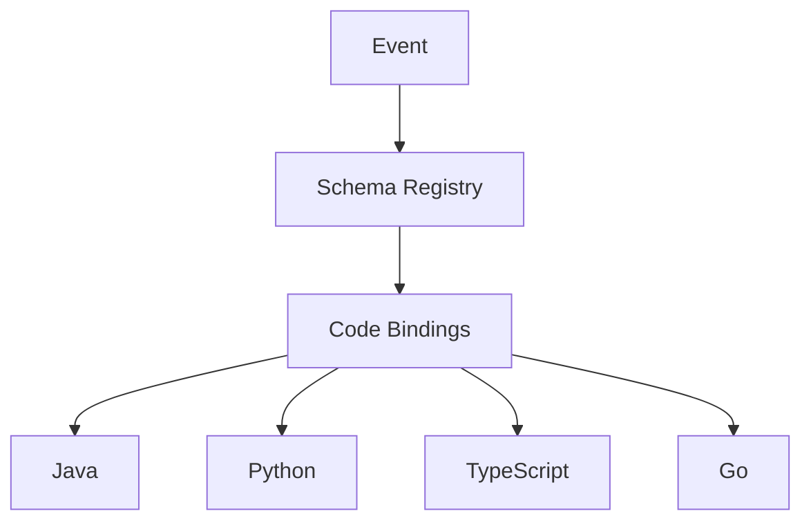
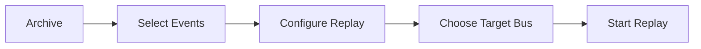
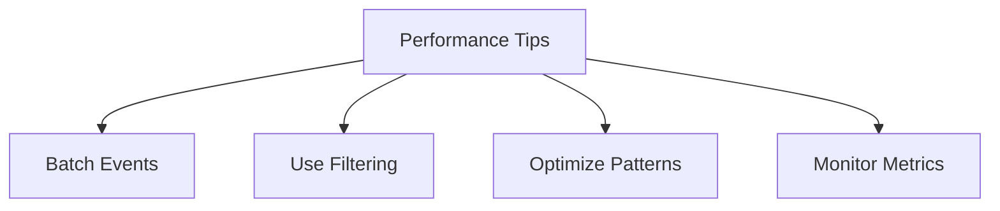

# Hướng dẫn Thực hành Amazon EventBridge

## Mục lục
1. [Event Bus Setup](#event-bus-setup)
2. [Tạo Rules](#tạo-rules)
3. [Schema Registry](#schema-registry)
4. [Tính năng Archive và Replay](#tính-năng-archive-và-replay)

## Event Bus Setup

### 1. Tạo Custom Event Bus


### Các bước thực hiện:
1. Truy cập EventBridge Console
2. Chọn "Event buses"
3. Tạo bus mới:
   - Tên: "central-event-bus-v2"
   - Cấu hình archive (tùy chọn)
   - Cấu hình schema discovery
   - Thiết lập resource policy

## Tạo Rules

### 1. Rule Configuration


### 2. Event Pattern Example - EC2 State Change
```json
{
  "source": ["aws.ec2"],
  "detail-type": ["EC2 Instance State-change Notification"],
  "detail": {
    "state": ["stopped", "terminated"]
  }
}
```

### 3. Target Setup
1. **Chọn Target Type**:
   - AWS Services
   - EventBridge bus
   - API destinations

2. **Cấu hình SNS**:
   - Chọn topic
   - Set permissions
   - Configure message

## Schema Registry

### 1. Schema Discovery


### 2. Schema Example (EC2)
```yaml
openapi: 3.0.0
schemas:
  AWSEvent:
    type: object
    properties:
      id:
        type: string
      source:
        type: string
      time:
        type: string
        format: date-time
```

## Tính năng Archive và Replay

### 1. Archive Setup
1. **Cấu hình Archive**:
   - Chọn event bus
   - Set retention period
   - Configure filters

### 2. Replay Functionality


## Testing và Monitoring

### 1. Event Pattern Testing
1. Sử dụng Sandbox mode
2. Test với sample events
3. Verify pattern matching

### 2. Monitoring và Debugging
- CloudWatch Metrics
- Check target delivery
- Review event logs

## Best Practices

### 1. Rule Design
- Sử dụng specific patterns
- Optimize target selection
- Test thoroughly

### 2. Performance


## Troubleshooting Guide

1. **Common Issues**:
   - Pattern không match
   - Target permissions
   - Delivery failures

2. **Resolution Steps**:
   - Check pattern syntax
   - Verify IAM roles
   - Review CloudWatch logs

3. **Maintenance**:
   - Regular testing
   - Update patterns
   - Clean up unused rules