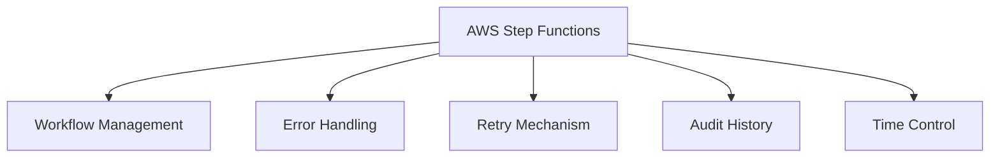
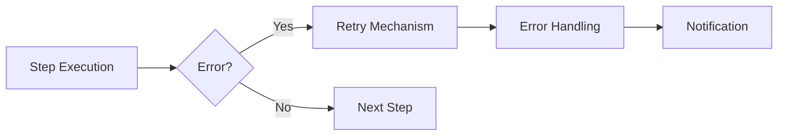
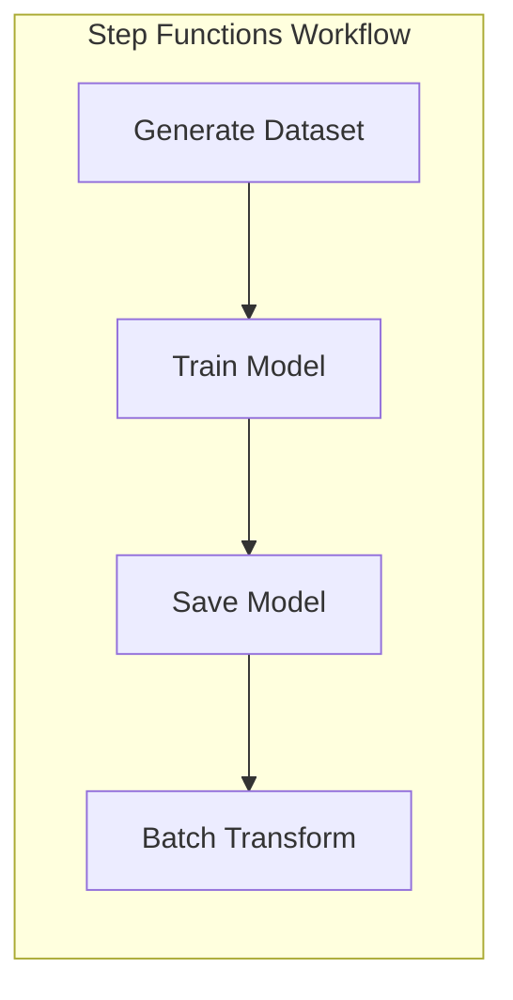
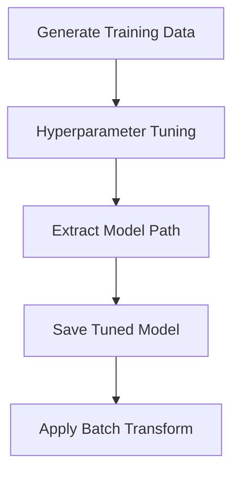
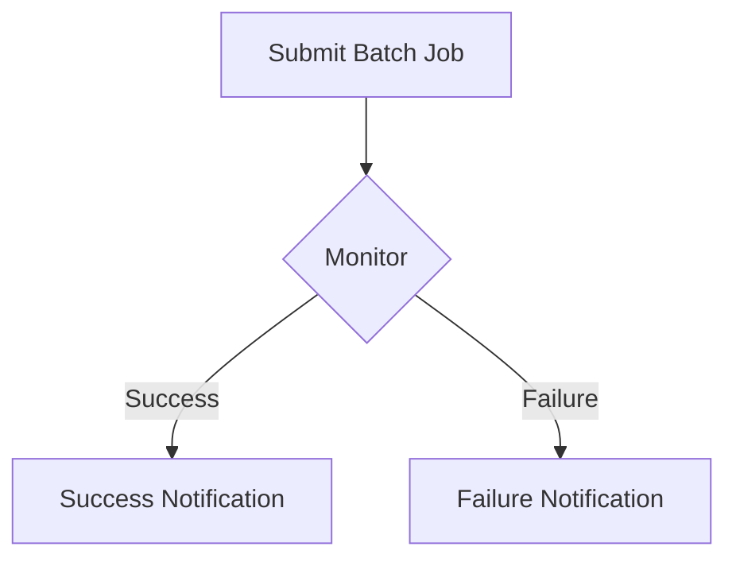
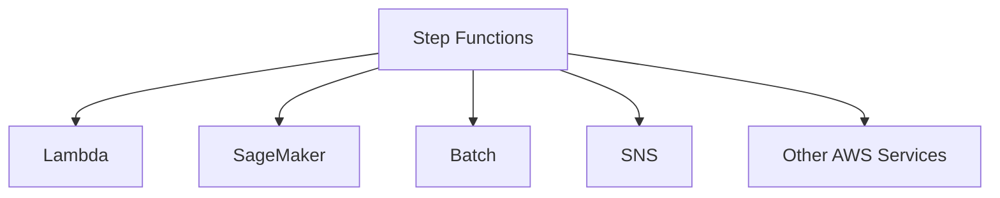

# Tổng quan về AWS Step Functions

## Mục lục
1. [Giới thiệu](#giới-thiệu)
2. [Tính năng chính](#tính-năng-chính)
3. [Use Cases](#use-cases)
4. [Kiến trúc và Hoạt động](#kiến-trúc-và-hoạt-động)

## Giới thiệu

AWS Step Functions là dịch vụ serverless cho phép điều phối các workflow phức tạp trên AWS, tích hợp nhiều dịch vụ khác nhau và trực quan hóa luồng xử lý.

### Đặc điểm chính

## Tính năng chính

### 1. Workflow Management
- Định nghĩa bằng Amazon States Language (ASL)
- Thời gian thực thi tối đa 1 năm
- Trực quan hóa workflow

### 2. Error Handling

## Use Cases

### 1. Machine Learning Pipeline

### 2. Model Tuning Workflow

### 3. Batch Job Management

## Kiến trúc và Hoạt động

### 1. Components
1. **State Machine**:
   - Workflow định nghĩa
   - Steps và transitions
   - Error handling rules

2. **States**:
   - Task states
   - Choice states
   - Parallel states
   - Wait states

### 2. Integration

## Best Practices

### 1. Workflow Design
- Modular steps
- Clear error handling
- Appropriate timeouts

### 2. Monitoring
- CloudWatch integration
- Audit history
- Performance metrics

### 3. Security
- IAM roles/permissions 
- Encryption
- Access control

## Lưu ý Quan trọng

### 1. Limitations
- Max execution time: 1 năm
- ASL syntax (không cần biết chi tiết cho exam)
- Service quotas

### 2. Use Case Selection
1. **Phù hợp cho**:
   - Complex workflows
   - Multi-step processes
   - Error handling requirements

2. **Không phù hợp cho**:
   - Simple single-step processes
   - Real-time processing
   - High-frequency tasks

## Tips và Tricks

1. **Workflow Management**:
   - Start small, scale up
   - Test thoroughly
   - Document steps

2. **Monitoring**:
   - Set up alerts
   - Regular audits
   - Performance tracking

3. **Maintenance**:
   - Version control
   - Regular updates
   - Backup strategies