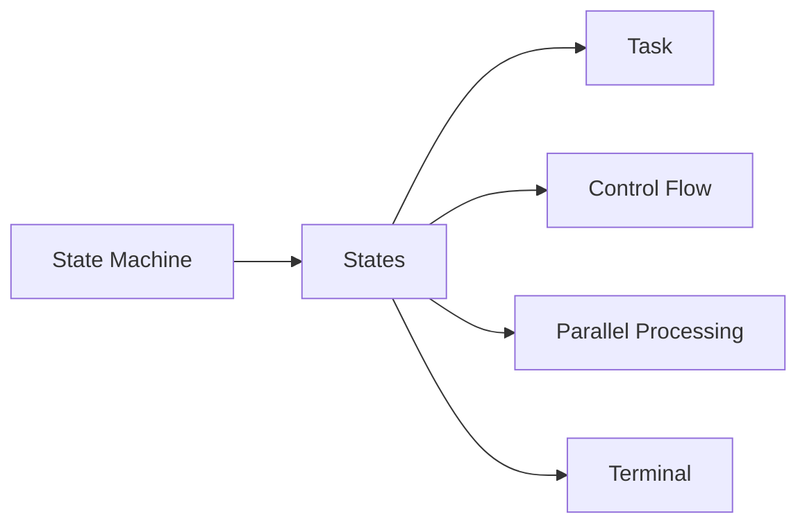
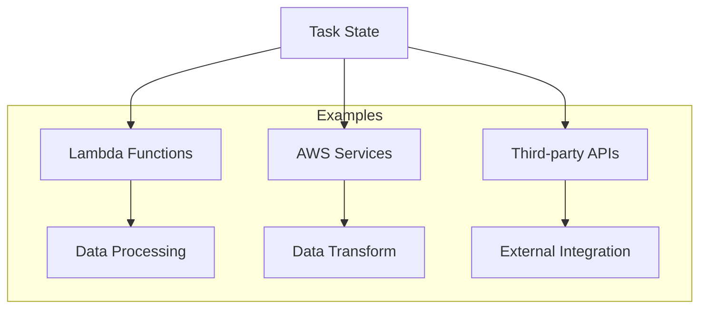
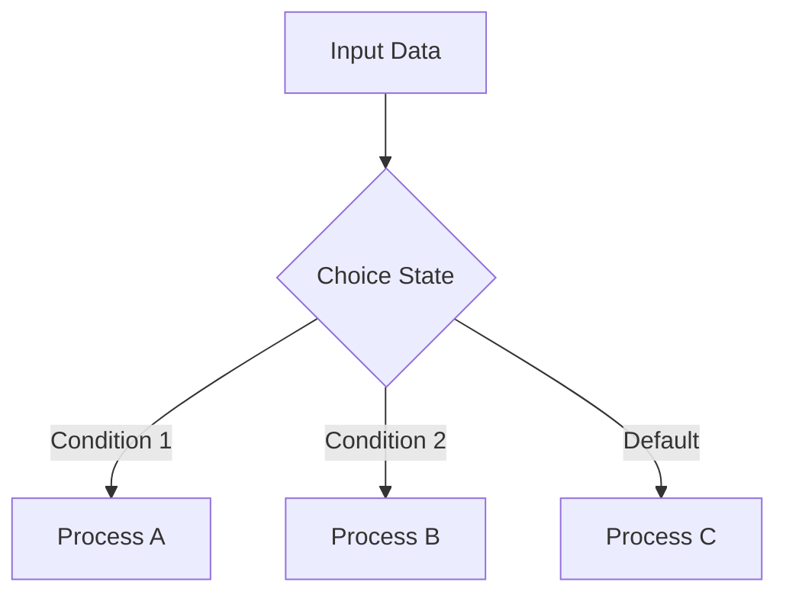
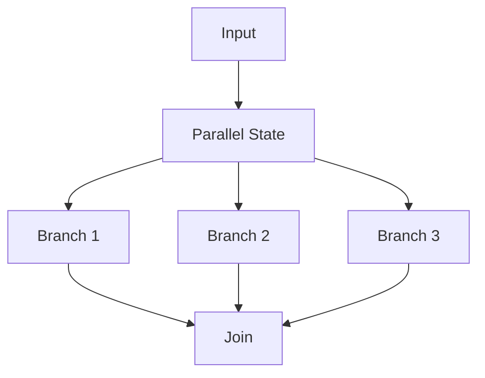
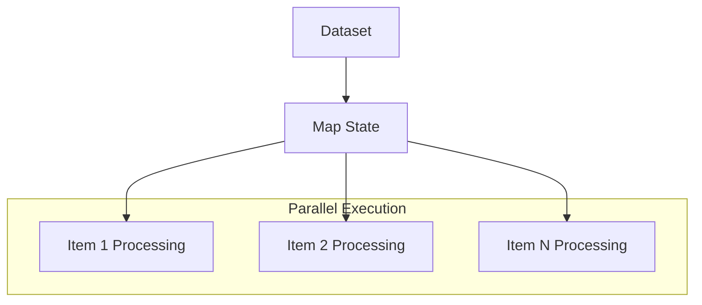
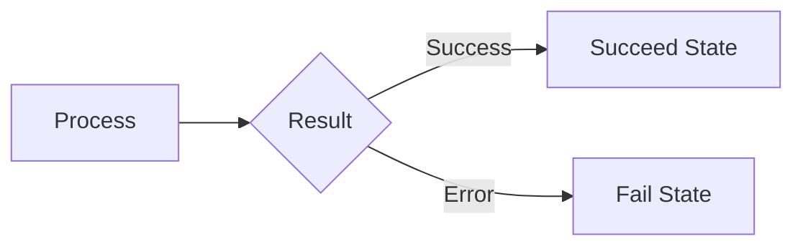
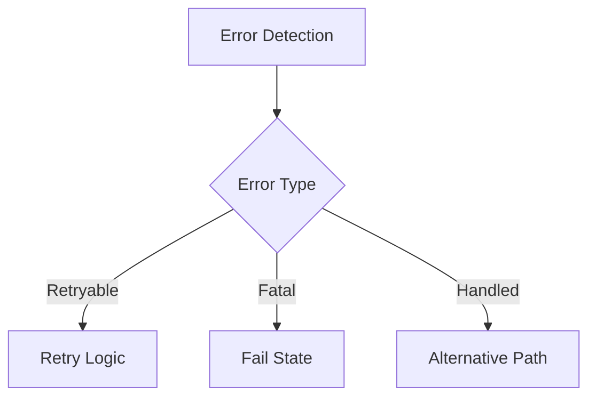

# Các loại State trong AWS Step Functions

## Mục lục
1. [Giới thiệu State Machine](#giới-thiệu-state-machine)
2. [Task State](#task-state)
3. [Control Flow States](#control-flow-states)
4. [Parallel Processing States](#parallel-processing-states)
5. [Terminal States](#terminal-states)

## Giới thiệu State Machine

## Task State

### Đặc điểm và Use Cases

## Control Flow States

### 1. Choice State

### 2. Wait State
- Tạm dừng execution
- Thời gian cố định/động
- Use cases:
  - Delay processing
  - Rate limiting
  - Synchronization

## Parallel Processing States

### 1. Parallel State

### 2. Map State

#### So sánh Map vs Parallel
| Tính năng | Map State | Parallel State |
|-----------|-----------|----------------|
| Mục đích | Xử lý dataset | Parallel branches |
| Input | Collection/Array | Bất kỳ |
| Parallelization | Tự động trên items | Manual branches |
| Use Case | Data processing | Workflow splitting |

## Terminal States

### 1. Pass State
- Chuyển data không xử lý
- Debugging purposes
- Không thay đổi input

### 2. Succeed/Fail States

## Best Practices

### 1. State Selection
- Chọn state phù hợp use case
- Tối ưu hóa parallel processing
- Error handling phù hợp

### 2. Performance
1. **Map State**:
   - Batch size phù hợp
   - Concurrent execution limits
   - Error handling strategy

2. **Parallel State**:
   - Resource allocation
   - Timeout configuration
   - Branch coordination

### 3. Error Handling

## Tips for Exam

1. **Key Differences**:
   - Map vs Parallel states
   - Task vs Pass states
   - Choice state conditions

2. **Use Cases**:
   - Data processing patterns
   - Workflow orchestration
   - Error handling scenarios

3. **Limitations**:
   - State transitions
   - Execution time
   - Input/output size