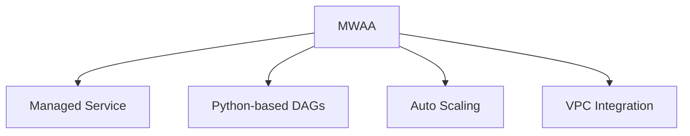
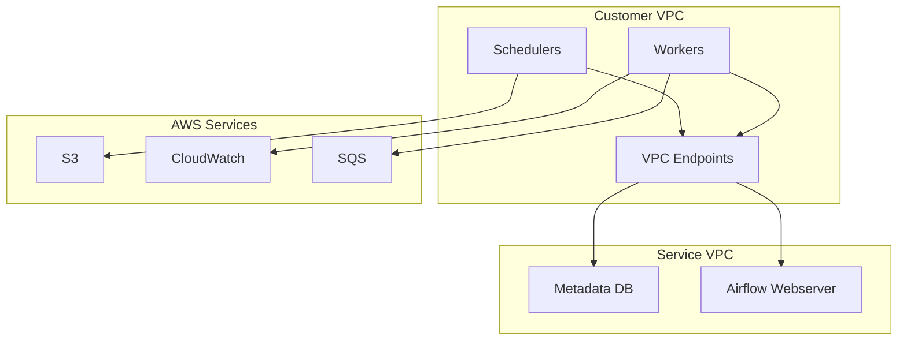
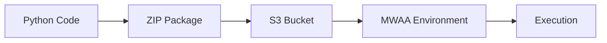
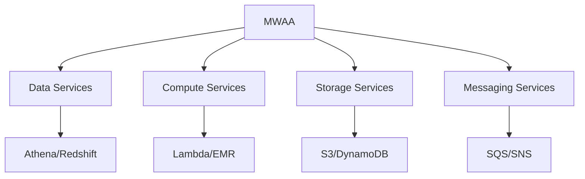
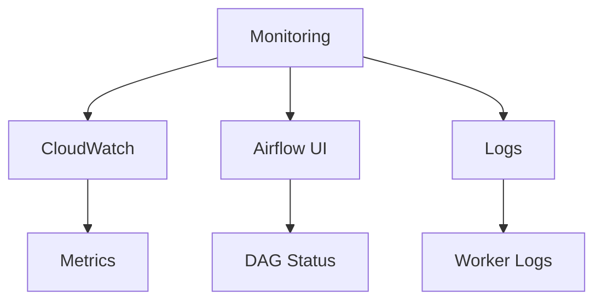

# Tổng quan về Amazon Managed Workflows for Apache Airflow (MWAA)

## Mục lục
1. [Giới thiệu](#giới-thiệu)
2. [Kiến trúc](#kiến-trúc)
3. [DAGs và Python](#dags-và-python)
4. [Tích hợp với AWS](#tích-hợp-với-aws)

## Giới thiệu

MWAA là dịch vụ managed Apache Airflow cho phép phát triển, lập lịch và giám sát các workflow bằng Python code.

### Đặc điểm chính


## Kiến trúc

### VPC Architecture


## DAGs và Python

### 1. DAG Structure
```python
# Example DAG
from airflow import DAG
from airflow.operators.bash import BashOperator

with DAG('simple_dag') as dag:
    task1 = BashOperator(task_id='hello', bash_command='echo hello')
    task2 = BashOperator(task_id='airflow', bash_command='echo airflow')
    task1 >> task2
```

### 2. Deployment Process


## Tích hợp với AWS

### 1. Supported Services


### 2. Security & Networking
1. **VPC Configuration**:
   - Tối thiểu 2 AZs
   - Private/Public endpoints
   - IAM integration

2. **Access Control**:
   - IAM roles
   - Security groups
   - VPC endpoints

## Deployment & Management

### 1. Scaling
- Auto-scaling workers
- Fargate containers
- Resource limits

### 2. Monitoring


## Best Practices

### 1. DAG Development
- Code version control
- Modular design
- Testing strategy

### 2. Performance
1. **Optimization**:
   - Worker configuration
   - Resource allocation
   - Task scheduling

2. **Reliability**:
   - Error handling
   - Retries
   - Monitoring

### 3. Security
- IAM roles
- Network isolation
- Secrets management

## Tips cho Kỳ thi

1. **Kiến thức cần nhớ**:
   - Kiến trúc VPC
   - Python-based DAGs
   - Service integrations

2. **Không cần biết**:
   - Python code chi tiết
   - DAG syntax
   - Configuration details

3. **Focus areas**:
   - Service architecture
   - Integration capabilities
   - Security features