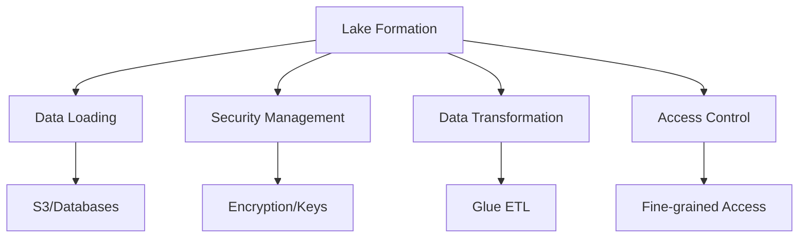
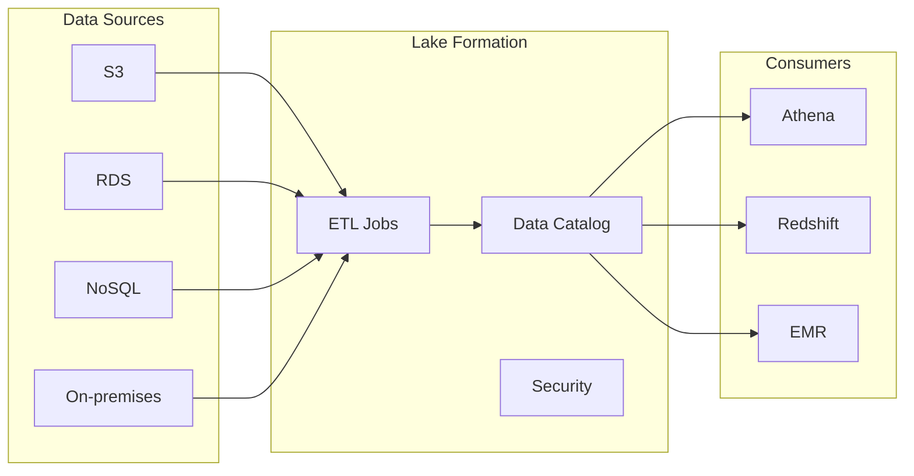
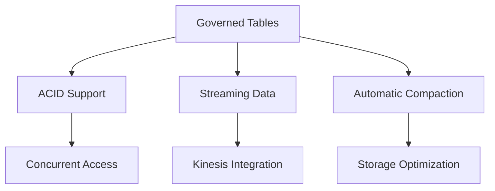
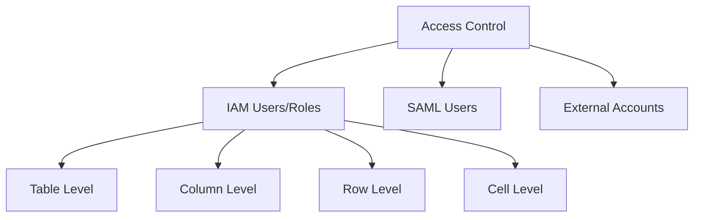
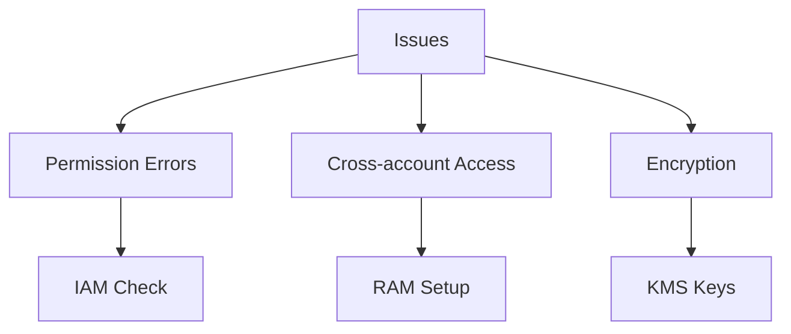

# Tổng quan về AWS Lake Formation

## Mục lục
1. [Giới thiệu](#giới-thiệu)
2. [Kiến trúc và Thành phần](#kiến-trúc-và-thành-phần)
3. [Tính năng mới](#tính-năng-mới)
4. [Quản lý Quyền truy cập](#quản-lý-quyền-truy-cập)

## Giới thiệu

AWS Lake Formation là dịch vụ giúp tạo và quản lý data lake một cách bảo mật, được xây dựng trên nền tảng AWS Glue.

### Đặc điểm chính

## Kiến trúc và Thành phần

### 1. Data Sources

### 2. Setup Process
1. Create IAM roles
2. Configure Glue connections
3. Set up S3 bucket
4. Register in Lake Formation
5. Create database
6. Configure workflows
7. Grant permissions

## Tính năng mới

### 1. Governed Tables

### 2. Security Features
- Row-level security
- Cell-level security
- Column-level security
- Policy tags

## Quản lý Quyền truy cập

### 1. Permission Types

### 2. Cross-Account Access
1. **Requirements**:
   - Data Lake Administrator setup
   - AWS RAM configuration
   - IAM permissions

### 3. Fine-grained Control
| Level | Control Type | Examples |
|-------|-------------|----------|
| Table | CRUD operations | Select, Insert, Delete |
| Column | Field access | Specific columns |
| Row | Data filtering | Based on conditions |
| Cell | Value access | Individual values |

## Troubleshooting Guide

### 1. Common Issues

### 2. Limitations
- No manifest support in queries
- Immutable governed table choice
- KMS permissions requirements

## Best Practices

### 1. Security
- Use policy tags
- Implement least privilege
- Regular access review

### 2. Performance
- Monitor compaction
- Optimize partitioning
- Configure streaming properly

### 3. Maintenance
1. **Regular Tasks**:
   - Audit permissions
   - Review access patterns
   - Update security policies

2. **Monitoring**:
   - Storage usage
   - Access patterns
   - Performance metrics