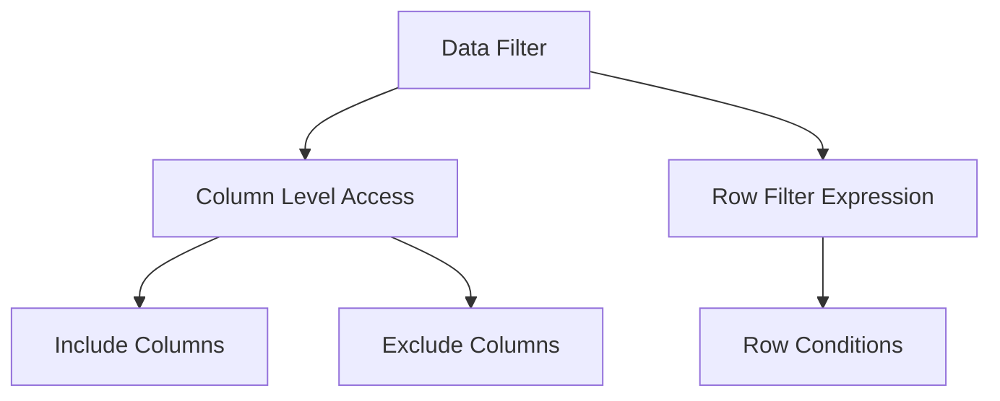
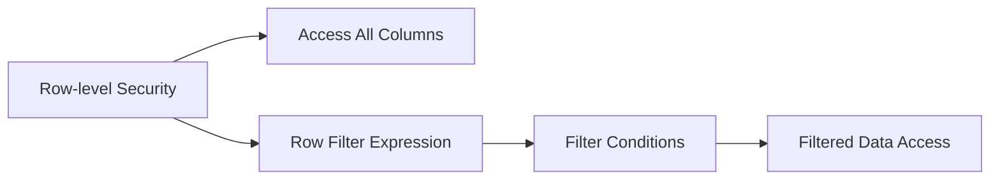
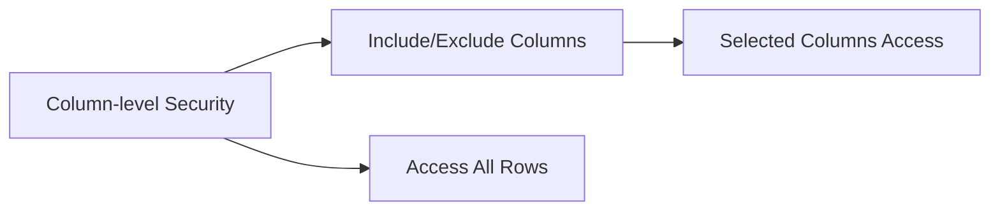
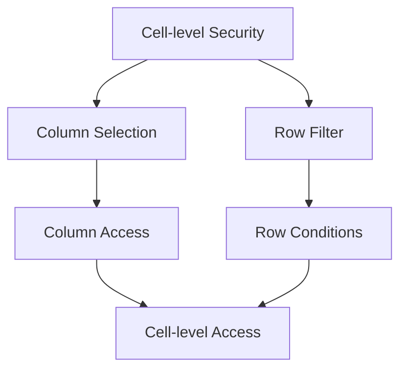
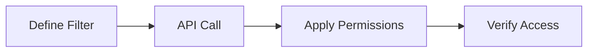
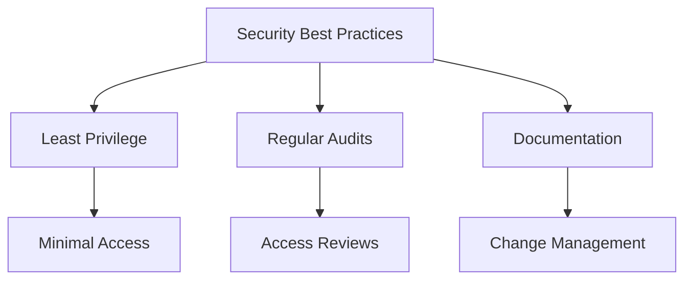

# Data Filters trong AWS Lake Formation

## Mục lục
1. [Tổng quan](#tổng-quan)
2. [Các loại Filter](#các-loại-filter)
3. [Cấu hình Filter](#cấu-hình-filter)
4. [Thực hiện qua API](#thực-hiện-qua-api)

## Tổng quan

Data Filters trong Lake Formation cho phép thiết lập bảo mật chi tiết ở các mức: column, row và cell.

### Cấu trúc Filter


## Các loại Filter

### 1. Row-level Security


**Cấu hình**:
- Column Level Access: All columns
- Row Filter Expression: Condition applied

### 2. Column-level Security


**Cấu hình**:
- Column Level Access: Selected columns
- Row Filter Expression: Empty

### 3. Cell-level Security


## Cấu hình Filter

### 1. Console Setup
1. **Tạo Filter**:
   - Chọn database và table
   - Đặt tên filter
   - Cấu hình access levels

2. **Column Access**:
   - Include specific columns
   - Exclude specific columns
   - Access all columns

3. **Row Filter**:
   - Define filter expression
   - Set conditions
   - Apply logic

### 2. Configuration Matrix
| Security Level | Column Access | Row Filter | Use Case |
|---------------|---------------|------------|-----------|
| Row | All Columns | Yes | Filter rows based on conditions |
| Column | Selected | No | Restrict column access |
| Cell | Selected | Yes | Combined column & row filtering |

## Thực hiện qua API

### 1. API Commands
```bash
# Create data filter
aws lakeformation create-data-cells-filter \
    --name "filter-name" \
    --database "db-name" \
    --table "table-name" \
    --column-names "col1" "col2" \
    --row-filter-expression "condition"
```

### 2. Implementation Flow


## Best Practices

### 1. Filter Design
- Sử dụng meaningful names
- Document filter purposes
- Regular review và update

### 2. Security


### 3. Maintenance
1. **Regular Tasks**:
   - Review filter effectiveness
   - Update conditions as needed
   - Audit access patterns

2. **Monitoring**:
   - Track filter usage
   - Monitor performance impact
   - Review access logs

## Tips for Implementation

1. **Planning**:
   - Define security requirements
   - Map access patterns
   - Document filter logic

2. **Testing**:
   - Verify filter conditions
   - Test edge cases
   - Validate permissions

3. **Troubleshooting**:
   - Check filter syntax
   - Verify permissions
   - Review error logs