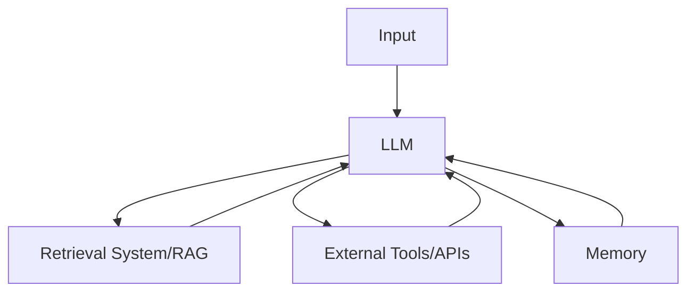

# Xây dựng hệ thống tự động với LLM: Từ đơn giản đến phức tạp

## Lời mở đầu

Trong thời gian gần đây, có rất nhiều framework được phát triển để xây dựng hệ thống tự động với LLM như Crew AI, Lancraft, Autogen... Tuy nhiên, theo khuyến nghị từ Anthropic, trong nhiều trường hợp bạn không cần những framework phức tạp này. Những triển khai LLM thành công nhất thường sử dụng các mẫu (pattern) đơn giản có thể kết hợp với nhau.

## 1. Định nghĩa về Agent

### 1.1. Agent là gì?

Một định nghĩa đơn giản về agent là:
- Một LLM có quyền truy cập vào nhiều công cụ khác nhau
- LLM có thể quyết định khi nào sử dụng công cụ nào

### 1.2. Hai loại hệ thống chính

Anthropic phân chia thành hai loại:

1. **Workflows (Quy trình làm việc)**
   - LLM và công cụ được phối hợp thông qua mã đã định nghĩa trước
   - Các bước rõ ràng, có thứ tự và dự đoán được
   - Giống như máy trạng thái truyền thống
   - Phù hợp với hầu hết các ứng dụng thực tế

2. **Agents (Tác nhân)**  
   - Giải quyết vấn đề độc lập
   - Tự động điều chỉnh quy trình và cách sử dụng công cụ
   - Mang tính xác suất cao hơn
   - Khó debug khi có lỗi

## 2. Khi nào nên dùng Agents?

### 2.1. Không nên dùng Agents khi:
- Hệ thống của bạn không cần tự động hoàn toàn
- Có thể giải quyết với quy trình đơn giản
- Cần tối ưu chi phí và độ trễ
- Cần độ chính xác và tính nhất quán cao

### 2.2. Nên dùng Agents khi:
- Cần quyết định dựa trên mô hình nhiều hơn
- Không thể định nghĩa trước các bước cụ thể
- Cần sự linh hoạt cao trong việc giải quyết vấn đề
- Chấp nhận được chi phí cao hơn và độ trễ lớn hơn

## 3. Các Pattern Cơ bản

### 3.1. LLM Tăng cường (Augmented LLM)



Một LLM tăng cường cần:
- Hệ thống truy xuất (như RAG)
- Công cụ và API bên ngoài
- Bộ nhớ để theo dõi trạng thái

### 3.2. Chain - Chuỗi yêu cầu

```python
def process_chain(user_input):
    # Bước 1: Phân tích yêu cầu
    analysis = llm_call(prompt_template="analyze", input=user_input)
    
    # Bước 2: Tạo outline
    outline = llm_call(prompt_template="outline", input=analysis)
    
    # Bước 3: Tạo nội dung chi tiết
    final_content = llm_call(prompt_template="expand", input=outline)
    
    return final_content
```

Đặc điểm:
- Chia nhỏ task thành chuỗi các bước
- Output của bước trước là input của bước sau
- Có thể thêm checkpoints để kiểm tra kết quả

### 3.3. Router - Định tuyến

```python
def route_request(user_input):
    # Router LLM quyết định chuyển hướng
    routing_decision = router_llm.call(
        prompt=f"Phân loại yêu cầu sau: {user_input}"
    )
    
    # Chọn specialist LLM phù hợp
    if routing_decision == "code_review":
        return code_review_llm.call(user_input)
    elif routing_decision == "content_moderation":
        return moderation_llm.call(user_input)
    else:
        return general_llm.call(user_input)
```

Đặc điểm:
- Router LLM thông minh ở front-end
- Chuyển task đến specialist LLMs
- Phù hợp cho task phức tạp có thể phân loại rõ ràng

### 3.4. Distributed - Phân tán

```python
from concurrent.futures import ThreadPoolExecutor

def parallel_process(user_input):
    # Chia nhỏ task
    subtasks = task_decomposer(user_input)
    
    # Xử lý song song
    with ThreadPoolExecutor(max_workers=3) as executor:
        results = list(executor.map(process_subtask, subtasks))
    
    # Tổng hợp kết quả
    return aggregate_results(results)
```

Đặc điểm:
- Thực hiện tasks song song
- Có thể chia nhỏ task hoặc dùng nhiều LLM 
- Tổng hợp kết quả cuối cùng

## 4. Pattern Nâng cao

### 4.1. Coordinator-Workers

```python
class CoordinatorSystem:
    def __init__(self):
        self.coordinator = LLM(system_prompt=COORDINATOR_PROMPT)
        self.workers = [LLM(system_prompt=WORKER_PROMPT) for _ in range(3)]
    
    def process(self, task):
        # Coordinator phân chia task
        subtasks = self.coordinator.plan_tasks(task)
        
        # Workers xử lý song song
        results = []
        for subtask in subtasks:
            worker = self.select_worker()
            results.append(worker.process(subtask))
            
        # Coordinator tổng hợp
        return self.coordinator.aggregate(results)
```

Đặc điểm:
- Coordinator LLM phân chia task
- Workers thực hiện các subtasks
- Linh hoạt hơn distributed pattern

### 4.2. Evaluator-Optimizer

```python
def iterative_improvement(initial_content):
    current_content = initial_content
    max_iterations = 5
    
    for i in range(max_iterations):
        # Đánh giá
        evaluation = evaluator_llm.evaluate(current_content)
        
        if evaluation.meets_criteria():
            break
            
        # Tối ưu dựa trên đánh giá
        current_content = optimizer_llm.improve(
            content=current_content,
            feedback=evaluation.feedback
        )
    
    return current_content
```

Đặc điểm:
- Một LLM tạo content
- LLM khác đánh giá và phản hồi
- Lặp lại cho đến khi đạt yêu cầu

## 5. Best Practices & Lưu ý

### 5.1. Khi bắt đầu một dự án mới:

1. **Luôn bắt đầu đơn giản**
   - Thử nghiệm với quy trình đơn giản trước
   - Chỉ thêm độ phức tạp khi thực sự cần thiết
   - Tránh over-engineering từ đầu

2. **Về việc sử dụng Framework**
   - Tốt cho prototype và thử nghiệm
   - Có thể gây khó khăn khi scale
   - Cân nhắc xây dựng giải pháp riêng cho production

3. **Monitoring và Debug**
   - Log đầy đủ các bước xử lý
   - Thêm checkpoints để kiểm tra output
   - Có strategy rõ ràng để handle errors

### 5.2. Một số anti-patterns cần tránh:

1. **Quá phụ thuộc vào Framework**
   - Khó customize cho use case cụ thể
   - Khó scale và maintain
   - Phức tạp không cần thiết

2. **Lạm dụng tự động hóa**
   - Tăng chi phí và độ trễ
   - Khó debug khi có lỗi
   - Giảm tính dự đoán được

3. **Thiếu kiểm soát và giám sát**
   - Khó phát hiện và xử lý lỗi
   - Không có metrics rõ ràng
   - Thiếu strategy để handle edge cases

## Kết luận

Việc xây dựng hệ thống tự động với LLM không nhất thiết phải phức tạp. Thay vì sử dụng các framework nặng nề, chúng ta có thể:

1. Bắt đầu với các pattern đơn giản
2. Kết hợp chúng một cách linh hoạt
3. Chỉ thêm độ phức tạp khi thực sự cần thiết

Điều quan trọng là hiểu rõ use case của mình và chọn pattern phù hợp, thay vì áp dụng một giải pháp phức tạp ngay từ đầu.

*Bài viết được tổng hợp từ hướng dẫn của Anthropic về xây dựng hệ thống tự động với LLM.*